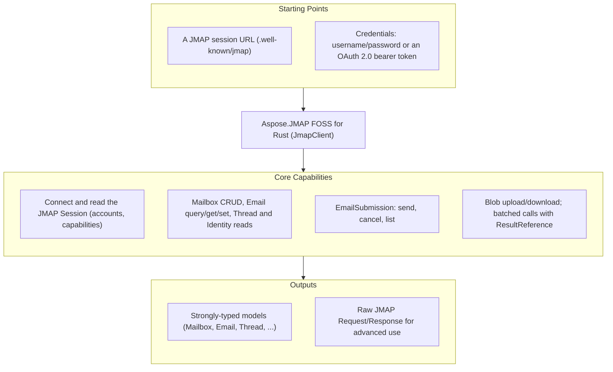

# Aspose.JMAP FOSS for Rust

[](LICENSE) [](https://github.com/aspose-email-foss/Aspose.JMAP-FOSS-for-Rust/graphs/contributors)

Aspose.JMAP FOSS for Rust is a free, open source JMAP client crate — for talking to a
[JMAP](https://jmap.io) mail server over HTTP: [RFC 8620](https://www.rfc-editor.org/rfc/rfc8620)
Core (session, `Core/echo`, blob upload/download, batched method calls) and
[RFC 8621](https://www.rfc-editor.org/rfc/rfc8621) Mail (Mailbox/Email/Thread/Identity/SearchSnippet)
plus EmailSubmission. Its public API is styled after Aspose.Email's client conventions — a
`JmapClient` plus a `ClientOptions` struct, a `connect()` call that returns the session, and
strongly-typed message and folder models.

**This is an official Aspose open-source project. It does not contain or reference Aspose.Email
proprietary source.** The library is generated from hand-authored JMAP protocol specifications.

## Navigation

- [At a Glance](#at-a-glance)
- [Key Capabilities](#key-capabilities)
- [Installation](#installation)
- [Dependencies](#dependencies)
- [Quick Start](#quick-start)
- [Additional Examples](#additional-examples)
- [API Reference](#api-reference)
- [Documentation & Resources](#documentation--resources)
- [Scope and Limitations](#scope-and-limitations)
- [Development and Testing](#development-and-testing)
- [License](#license)

## At a Glance



## Key Capabilities

- **Connect and inspect the session** — `client.connect()` fetches `/.well-known/jmap` and
  returns the `Session` (account ids, `capabilities`, `api_url`, `upload_url`, `download_url`).
- **Mailboxes** — `list_mailboxes()`, `get_mailbox()`, `create_mailbox()`, `delete_mailbox()`
  wrap `Mailbox/get`, `Mailbox/query`, and `Mailbox/set`.
- **Messages** — `list_messages()`, `fetch_message()`, `move_message()`,
  `set_message_keyword()`, `delete_message()` over `Email/query`, `Email/get`, and `Email/set`.
- **Identities** — `list_identities()` over `Identity/get`.
- **Sending** — `send()`, `cancel_send()`, `list_submissions()` wrap `EmailSubmission/set` and
  `EmailSubmission/get`.
- **Blobs** — `upload_blob()` / `download_blob()` for `/upload` and `/download`.
- **Batching** — `send_request()` sends any `Vec<Invocation>` in one HTTP round trip, with
  `ResultReference` ([RFC 8620 §3.7](https://www.rfc-editor.org/rfc/rfc8620#section-3.7)) to
  chain one call's result into the next.
- **Pluggable transport** — the client takes an optional boxed `Transport`; every unit test
  supplies a fake, so no test needs a network.
- **OAuth 2.0** — `ClientOptions.bearer_token` ([RFC 6750](https://www.rfc-editor.org/rfc/rfc6750))
  as an alternative to HTTP Basic.

## Installation

No version has been published to crates.io yet; until one is, add a path or git dependency on a
local checkout (see [Development and Testing](#development-and-testing)). The intended published
name is `aspose-jmap-foss` (crate `aspose_jmap_foss`):

```bash
cargo add aspose-jmap-foss
```

## Dependencies

### Required Package Dependencies

`serde` and `serde_json` for (de)serialization. The HTTP transport is written against the
standard library — no `reqwest`/`hyper` in the default build.

### Native and System Requirements

- A Rust toolchain on the 2021 edition (stable).

### Development Dependencies

- None beyond `cargo test`; tests use in-crate `#[cfg(test)]` modules and a hand-written fake
  transport.

## Quick Start

```rust
use aspose_jmap_foss::{JmapClient, ClientOptions};

let options = ClientOptions {
    session_url: "https://jmap.example.test/.well-known/jmap".to_string(),
    username: "user@example.test".to_string(),
    password: "secret".to_string(),
    bearer_token: None,
    transport: None,
};
let mut client = JmapClient::new(options);
let session = client.connect()?;
```

## Additional Examples

### OAuth 2.0 bearer token authentication

Set `bearer_token` to authenticate every request with `Authorization: Bearer <token>`
([RFC 6750](https://www.rfc-editor.org/rfc/rfc6750)) instead of HTTP Basic. When it is
`Some(token)` with a non-empty `token`, it takes precedence and `username`/`password` are
ignored (they may be left as empty strings):

```rust
let options = ClientOptions {
    session_url: "https://jmap.example.test/.well-known/jmap".to_string(),
    username: String::new(),
    password: String::new(),
    bearer_token: Some("my-oauth-access-token".to_string()),
    transport: None,
};
let mut client = JmapClient::new(options);
let session = client.connect()?;
```

<details>
<summary>Batching requests with ResultReference</summary>

Multiple method calls can be batched into a single HTTP round trip via `send_request`, using a
`ResultReference` ([RFC 8620 §3.7](https://www.rfc-editor.org/rfc/rfc8620#section-3.7)) to chain
a later call to an earlier one's result without a second request:

```rust
use aspose_jmap_foss::{Invocation, ResultReference};
use serde_json::json;
use std::collections::HashMap;

let query = Invocation {
    name: "Email/query".to_string(),
    arguments: HashMap::from([("accountId".to_string(), json!(account_id))]),
    method_call_id: "c1".to_string(),
};
let get = Invocation {
    name: "Email/get".to_string(),
    arguments: HashMap::from([
        ("accountId".to_string(), json!(account_id)),
        (
            "#ids".to_string(),
            serde_json::to_value(ResultReference {
                result_of: "c1".to_string(),
                name: "Email/query".to_string(),
                path: "/ids".to_string(),
            })
            .unwrap(),
        ),
    ]),
    method_call_id: "c2".to_string(),
};
let resp = client.send_request(vec![query, get], vec!["urn:ietf:params:jmap:mail".to_string()])?;
```

</details>

## API Reference

`JmapClient` (with `ClientOptions`) is the single entry point; the model types `Session`,
`Mailbox`, `Email`, `EmailAddress`, `Thread`, `Identity`, `EmailSubmission`, and `SearchSnippet`
mirror the JMAP objects one-to-one, and `Invocation` / `ResultReference` model raw method calls
for `send_request`. Errors surface as `JmapNetworkError` (transport) and `JmapProtocolError` (a
JMAP method-level error); per-item `Set` failures are returned as data on the result rather than
as an `Err`.

The protocol/API reference is generated from the same specifications that drive this library.

## Documentation & Resources

- Found a bug or have a feature request? [Open an issue](https://github.com/aspose-email-foss/Aspose.JMAP-FOSS-for-Rust/issues) on GitHub.

## Scope and Limitations

- **Protocol**: JMAP Core (RFC 8620) and JMAP Mail (RFC 8621: Mailbox/Email/Thread/Identity/SearchSnippet)
  plus EmailSubmission.
- **Out of scope for v1**:
  - Push / `EventSource` streaming — the type exists but is a stub/no-op.
  - JMAP for Calendars and Contacts.
  - `Date`/`UTCDate` values are kept as raw RFC 3339 strings (no `chrono` parsing) to avoid
    timezone-conversion bugs.
- Unit tests run against a fake `Transport` with mocked responses — no live JMAP server is
  required. A Docker-based live-server integration suite (Stalwart Mail Server) lives in
  [`infra/integration/`](../../infra/integration/README.md).

## Development and Testing

```bash
git clone https://github.com/aspose-email-foss/Aspose.JMAP-FOSS-for-Rust.git
cd Aspose.JMAP-FOSS-for-Rust
cargo build
cargo test
```

See [`infra/integration/README.md`](../../infra/integration/README.md) for the live-server suite.

## License

This project is licensed under the [MIT License](LICENSE). The MIT License permits use, copying,
modification, distribution, sublicensing, and commercial use, provided its copyright and
permission notice are retained. The software is provided without warranty.
